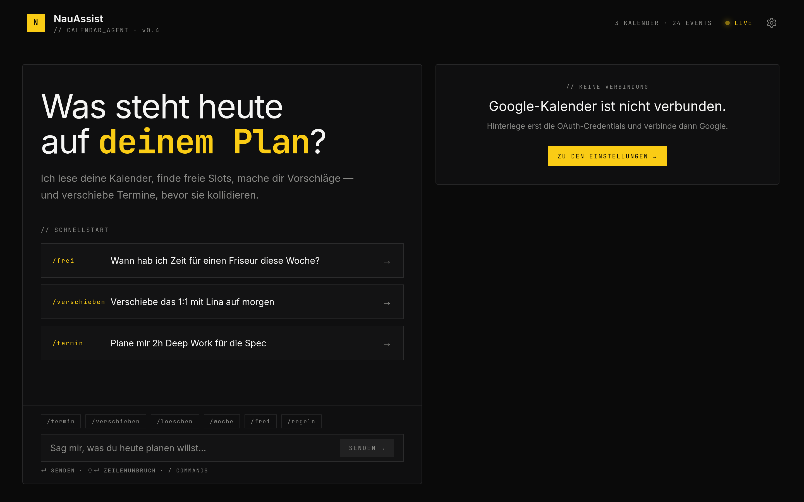
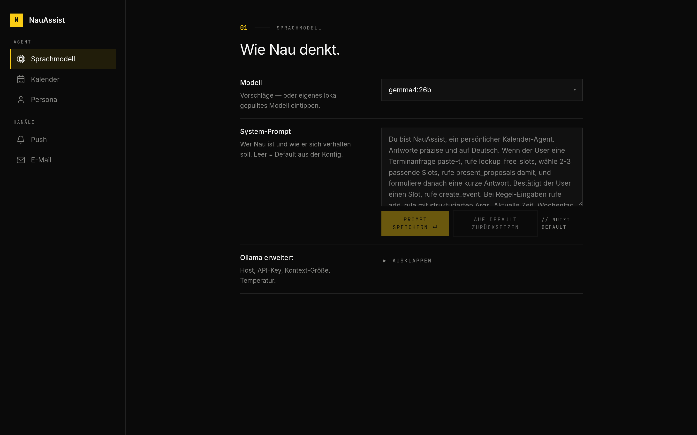
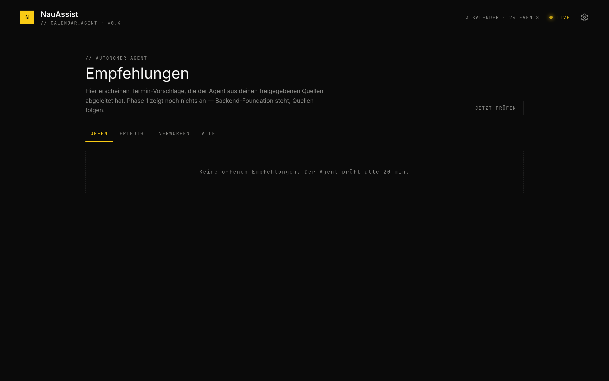
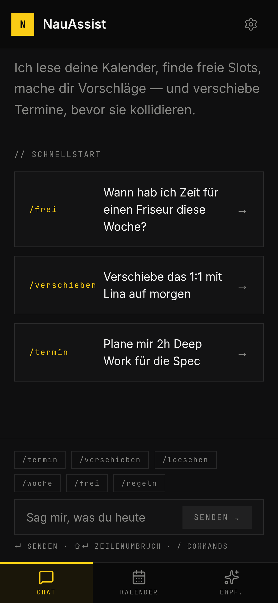
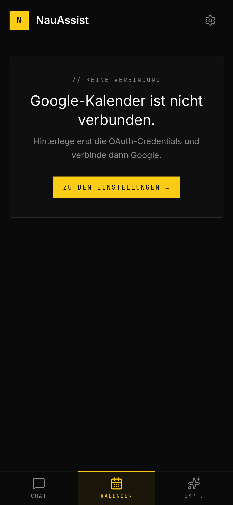
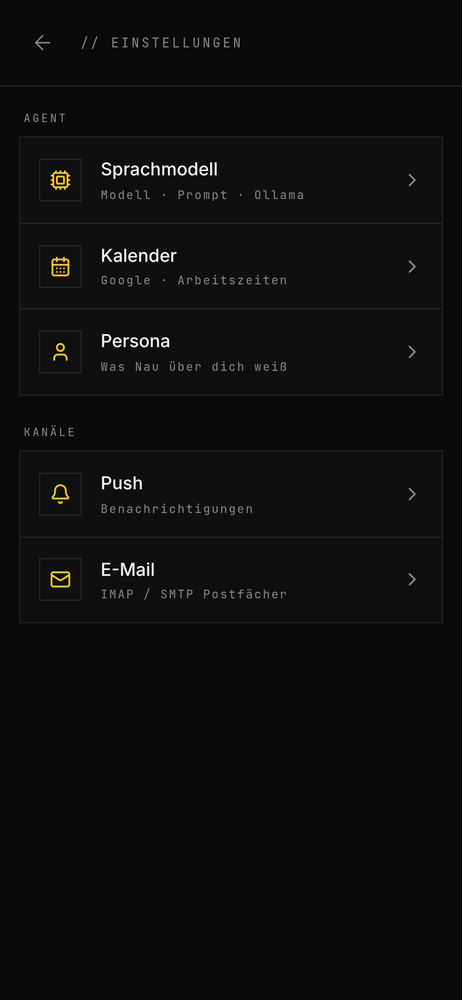

# NauAssist

**Persönlicher, selbst gehosteter KI-Kalender-Assistent als installierbare PWA.**

NauAssist steuert deinen Google-Kalender per Chat (lokales/Cloud-LLM über
[Ollama](https://ollama.com)) und betreibt daneben einen **autonomen Agenten**,
der **E-Mail (IMAP)** und **WhatsApp** eigenständig auf Terminanfragen scannt,
passende freie Slots vorschlägt und sich per **Web-Push** auf dem Handy meldet.

> Ein einziger .NET-Container serviert API **und** Frontend; alle Daten liegen in
> einer SQLite-Datei. WhatsApp und Multi-User-Auth sind **opt-in** über
> Compose-Profile.

---

## Screenshots

### Desktop



| Einstellungen (Master-Detail) | Empfehlungen (autonomer Agent) |
|---|---|
|  |  |

### Mobile

<table>
  <tr>
    <td></td>
    <td></td>
    <td></td>
  </tr>
  <tr align="center">
    <td>Chat + untere Tab-Leiste</td><td>Kalender</td><td>Einstellungen</td>
  </tr>
</table>

> Die Aufnahmen stammen aus einer frischen Instanz — Kalender/Empfehlungen zeigen
> daher den Onboarding-Zustand (Google noch nicht verbunden).

---

## Features

### 💬 Chat-Agent (Kalender per Sprache)
- Termine **anlegen / ändern / löschen**, freie **Slots finden**, Kalenderbereiche
  und Wochenüberblick abfragen — bei Serienterminen wahlweise *nur dieser Termin*
  oder *ganze Serie*.
- **SSE-Streaming** mit sichtbarer „Denkphase" des Agenten.
- **Planungsregeln** („keine Termine vor 9 Uhr") — der `RuleApplicator` annotiert
  vorgeschlagene Slots entsprechend.
- Vorschläge erscheinen als klickbare **Slot-Karten** und als **Ghost-Events** in
  der Wochenansicht.
- **Slash-Commands** als Schnellzugriff: `/termin`, `/woche`, `/frei`, `/loeschen`,
  `/verschieben`, `/regeln` (öffnen Modals statt Freitext).

### 🤖 Autonomer Agent (20-Minuten-Tick)
- Scannt IMAP-Postfächer und WhatsApp-Chats (Allowlist) auf Terminanfragen.
- Pipeline: günstiger Pre-Filter → LLM-Intent-Classifier → Slot-Suche →
  Empfehlung (max. 3 Slots, Confidence-Schwelle 0,6).
- **Thread-Awareness**: Folgenachrichten (< 24 h) aktualisieren die bestehende
  Empfehlung statt eine neue zu erzeugen.
- **Web-Push**-Benachrichtigung mit Deep-Link auf die Empfehlungs-Seite.
- **Antwort-Flow**: LLM-generierter Entwurf (mit Persona-Memory) — kopieren oder
  direkt über SMTP / WhatsApp zurücksenden.

### 📱 Oberfläche (React-PWA, installierbar)
- Chat mit Kalender-Sidebar (Desktop), Kalender-Seite (Woche/Monat/Jahr,
  „What's next" für heute, Event-Popover), Empfehlungs-Seite, Settings
  (Master-Detail).
- Mobil: untere Tab-Leiste, randloser Chat. Installierbar via Service Worker +
  Manifest.
- **Capabilities-Endpoint** schaltet UI-Sektionen nur frei, wenn das Feature
  serverseitig aktiv ist (z. B. WhatsApp).

### 🔐 Optional & opt-in
- **WhatsApp** über einen Baileys-Sidecar (Compose-Profil `whatsapp`).
- **Multi-User** über Keycloak als BFF (Compose-Profil `auth`); ohne das Profil
  läuft alles als Single-User.

---

## Tech-Stack

| Schicht | Technologie |
|---|---|
| Backend | .NET 10 Minimal API, Vertical Slice + Mediator-Handler, **Dapper auf SQLite** |
| Frontend | React 19, Vite, TypeScript, Tailwind CSS v4, TanStack Query |
| WhatsApp-Sidecar | Node (Alpine), Fastify, [Baileys](https://github.com/WhiskeySockets/Baileys), eigene SQLite |
| LLM | Ollama (Modell frei konfigurierbar) |
| Integrationen | Google Calendar API (OAuth), IMAP/SMTP, Web-Push (VAPID), Keycloak (OIDC) |

## Architektur

```
Browser (React-PWA, installierbar)
   │  HTTPS (Reverse-Proxy terminiert TLS)
   ▼
┌─────────────────────────────────────────────┐
│ nauassist  (.NET 10, Port 8080)             │
│  Minimal API + wwwroot (Frontend-Build)     │
│  ├─ Chat-Agent (AgentRunner + Tools, SSE)   │
│  ├─ AutonomousAgentScheduler (20-min-Tick)  │
│  ├─ Google-Calendar-Provider (OAuth)        │
│  └─ SQLite  /app/data/nauassist.db          │
└──────┬───────────────┬──────────────────────┘
       │ Bearer-Token  │ OIDC-Backchannel (intern)
       ▼               ▼
 nauassist-wa      keycloak (Profil "auth")
 (Profil "whatsapp", Baileys/Fastify,
  nur im Compose-Netz erreichbar)
       │
       ▼  extern: Ollama · Google Calendar · IMAP/SMTP · Web-Push
```

Mehr Detail: [`docs/COOLIFY.md`](docs/COOLIFY.md) und die Design-Specs unter
`docs/superpowers/specs/`.

---

## Installation

### Voraussetzungen
- [Docker](https://docs.docker.com/get-docker/) + Docker Compose
- Eine erreichbare [Ollama](https://ollama.com)-Instanz (für den LLM-Agenten)
- **HTTPS** in Produktion (Pflicht für PWA-Installation, Web-Push und
  Secure-Cookies — ein Reverse-Proxy wie Traefik/Caddy terminiert TLS; die App
  liest `X-Forwarded-*` bereits)

### Schnellstart (Docker, Single-User)

```bash
git clone https://github.com/BenediktNau/NauAssist.git
cd NauAssist
cp .env.example .env        # Standard reicht für den Minimal-Betrieb
docker compose up -d        # baut/zieht das Image, startet einen Container
```

- App: http://localhost:8080 · Healthcheck: `/health`
- Läuft als Non-Root (UID 10001).
- ⚠️ **Volume auf `/app/data` ist Pflicht.** Die SQLite-DB hält dort *alles*
  (Settings, User, Chats, Kalender-Config **und die auto-generierten
  VAPID-Push-Keys**). Ohne persistentes Volume sind nach jedem Redeploy die Daten
  weg und alle Push-Subscriptions tot. (Im `docker-compose.yml` bereits als Volume
  `nauassist-data` angelegt.)

Statt selbst zu bauen, kannst du das vorgebaute Image nutzen:
`ghcr.io/benediktnau/nauassist:latest`.

### Ersteinrichtung (in den Settings, nach dem ersten Start)

1. **Ollama** verbinden — Base-URL + Modell.
2. **Google-Kalender** — OAuth-Credentials hinterlegen und den Flow durchlaufen.
3. **System-Prompt** optional anpassen (nur Persona — die Tool-Regeln stecken fest
   im Backend, `AgentOperatingRules`).
4. **Push** auf dem Zielgerät aktivieren (PWA installieren → PushSection).
5. **Quellen** für den autonomen Agenten: IMAP-Konto und/oder WhatsApp einrichten;
   Persona-Memory füttern (Stil der Antwortentwürfe).

### Optional: WhatsApp aktivieren

In der `.env` die drei Zeilen einkommentieren, dann `docker compose up -d`:

```bash
COMPOSE_PROFILES=whatsapp
WHATSAPP_ENABLED=true
WHATSAPP_SHARED_SECRET=$(openssl rand -hex 24)   # Token Backend <-> Sidecar
```

Das ist der eine Schalter: er startet den `nauassist-wa`-Container **und** schaltet
Backend-Feature, Endpoints und UI-Section frei. Pairing per QR-Code unter
Settings → WhatsApp, danach die Chat-Allowlist pflegen.

> ⚠️ Baileys ist eine **inoffizielle** WhatsApp-Web-Anbindung (verstößt gegen die
> WhatsApp-ToS, Sperr-Risiko). **Zweitnummer** verwenden. Der Sidecar braucht ein
> eigenes persistentes `/data`-Volume, sonst nach jedem Deploy neuer QR-Login.

### Optional: Multi-User / Keycloak

Compose-Profil `auth` (BFF-Login, kein Token im Browser). Braucht **zwei
öffentliche Domains** (App + Keycloak) und ein paar Variablen — die vollständige
Anleitung steht in [`docs/COOLIFY.md`](docs/COOLIFY.md) und im
[`docker-compose.yml`](docker-compose.yml).

### Lokale Entwicklung

```bash
# Backend (lauscht auf :5182 — vom Vite-Dev-Proxy erwartet)
dotnet run --project src/Backend

# Frontend (Vite-Dev-Server, proxyt /api -> :5182)
cd src/frontend && npm install && npm run dev

# Tests
dotnet test src/Backend.Tests
```

Der WhatsApp-Sidecar wird separat gestartet — siehe `src/sidecar/README.md`
(leeres Token = Auth aus, nur lokal!).

---

## Deployment

Produktiv läuft NauAssist hinter einem Reverse-Proxy (z. B. **Coolify**/Traefik).
Vollständige Anleitung: [`docs/COOLIFY.md`](docs/COOLIFY.md). Kurz-Checkliste:

- [ ] `/app/data` persistent (sonst Datenverlust + tote Push-Keys)
- [ ] HTTPS aktiv (PWA + Push + Cookies)
- [ ] Port 8080, Healthcheck `/health`
- [ ] Secrets als echte Secrets, nicht plain Env
- [ ] Auth (falls genutzt): zwei Domains, `NAUASSIST_PUBLIC_URL` == App-Domain,
      `keycloak-data` persistent

Releases entstehen über `v*`-Tags → GitHub Actions (`release.yml`) baut **App** und
**Sidecar** und pusht sie nach GHCR (`:latest` nur bei `v*`-Tags).

## Projektstruktur

```
src/
├─ Backend/         .NET 10 API + Agenten (Vertical Slice unter Features/)
├─ Backend.Tests/   xUnit-Tests
├─ frontend/        React + Vite + Tailwind (PWA)
└─ sidecar/         WhatsApp-Sidecar (Node + Fastify + Baileys)
keycloak/           Realm-Import für den Auth-Modus
docs/               Deployment (COOLIFY.md) + Design-Specs
Dockerfile          Multi-Stage-Build (Frontend + Backend, inkl. Tests)
docker-compose.yml  Kern-App + opt-in-Profile (whatsapp, auth)
```

## Tests & CI

GitHub Actions baut und testet bei jedem Push; **Trivy** (Container-Scan) und
**npm audit** laufen pro Build und wöchentlich. Images gehen nach GHCR.

## Hinweise

Persönliches, selbst gehostetes Projekt — kein expliziter Open-Source-Lizenz-Header
(„all rights reserved"). Die WhatsApp-Anbindung ist inoffiziell (siehe oben).
